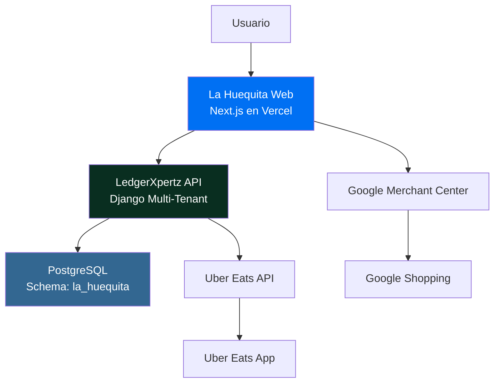
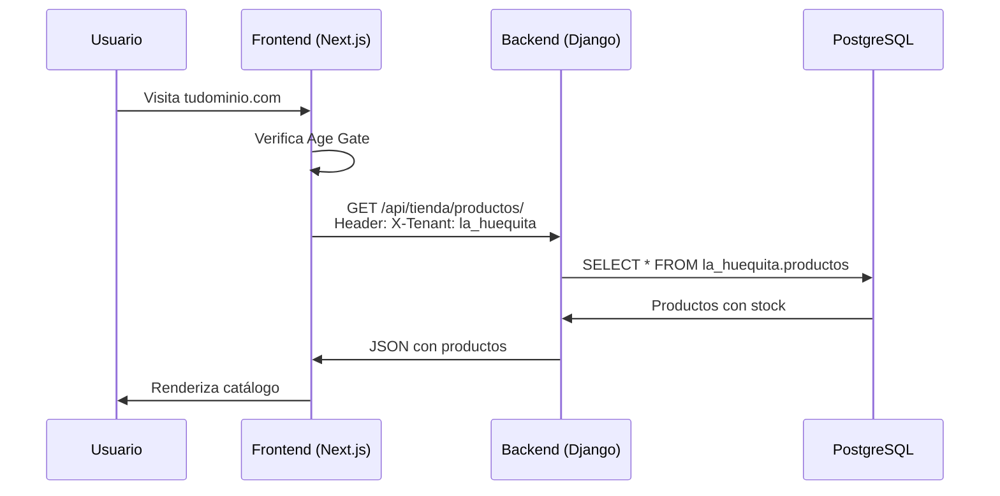

# 📦 Resumen del Proyecto - La Huequita Web

## ✅ Estado Actual del Repositorio

**Repositorio**: `git@github.com:LuchoProgramer/lahuequitaquite-a.git`  
**Branch**: `main`  
**Commits**: 3 commits realizados  
**Estado**: ✅ Todo sincronizado con GitHub

---

## 📊 Arquitectura del Sistema

### Sistema Multi-Tenant LedgerXpertz



### Flujo de Datos



---

## 📁 Estructura del Proyecto

```
la-huequita-web/
├── 📄 Documentación Principal
│   ├── README.md                                    ← Descripción del proyecto
│   ├── ARQUITECTURA.md                              ← Arquitectura completa
│   ├── FEEDBACK.md                                  ← Review técnico (4/5 ⭐)
│   └── docs/PLAN_ESPECIFICO.md                      ← Plan original
│
├── 🚀 Guías de Deployment
│   ├── DEPLOY_VERCEL.md                             ← Deploy a Vercel
│   └── SETUP_DOMINIO_Y_MERCHANT_CENTER.md           ← Dominio + Merchant Center
│
├── 📈 Estrategias de Negocio
│   ├── SEO_STRATEGY.md                              ← SEO 100%
│   ├── PRICING_STRATEGY_DELIVERY.md                 ← Precios multi-plataforma
│   ├── MERCHANT_CENTER_ALCOHOL_REQUIREMENTS.md      ← Requisitos alcohol
│   ├── UBER_EATS_INTEGRATION.md                     ← Integración Uber Eats
│   └── UNIVERSAL_COMMERCE_PROTOCOL.md               ← Futuro con IA
│
├── 💻 Código Frontend
│   ├── app/                                         ← Next.js App Router
│   │   ├── page.tsx                                ← Home + Age Gate
│   │   ├── productos/                              ← Catálogo
│   │   ├── producto/[slug]/                        ← Detalle producto
│   │   ├── terminos/                               ← Términos
│   │   ├── privacidad/                             ← Privacidad
│   │   ├── politicas/                              ← Políticas
│   │   ├── feed.xml/                               ← Feed Merchant Center
│   │   └── api/                                    ← API Routes
│   │
│   ├── components/                                  ← Componentes React
│   │   ├── AgeGate.tsx                             ← Verificación edad
│   │   ├── catalog/                                ← Catálogo
│   │   ├── products/                               ← Productos
│   │   ├── tienda/                                 ← Tienda
│   │   └── common/                                 ← Comunes
│   │
│   ├── lib/                                         ← Utilidades
│   │   ├── api.ts                                  ← Cliente API
│   │   └── types.ts                                ← Tipos TypeScript
│   │
│   ├── contexts/                                    ← React Contexts
│   │   ├── CartContext.tsx                         ← Carrito
│   │   └── BranchContext.tsx                       ← Sucursal
│   │
│   └── middleware.ts                                ← Middleware Age Gate
│
└── ⚙️ Configuración
    ├── .env.local                                   ← Variables de entorno
    ├── .gitignore                                   ← Archivos ignorados
    ├── package.json                                 ← Dependencias
    ├── tsconfig.json                                ← TypeScript config
    ├── tailwind.config.ts                           ← Tailwind config
    └── next.config.ts                               ← Next.js config
```

---

## 🔧 Variables de Entorno Configuradas

```bash
# Backend
NEXT_PUBLIC_API_URL=https://api.ledgerxpertz.com/api

# Tenant
NEXT_PUBLIC_TENANT_ID=la_huequita

# Sitio Web (actualizar con dominio real)
NEXT_PUBLIC_SITE_URL=http://localhost:3000

# Seguridad
REVALIDATION_SECRET=OTqOn8R7t3N8jhKxKNGV4HBFUSVfvlcckpyPQNg0Pa0
```

> ⚠️ **Importante**: Al hacer deploy a Vercel, actualizar `NEXT_PUBLIC_SITE_URL` con tu dominio real.

---

## ✅ Funcionalidades Implementadas

### Frontend
- ✅ Age Gate (verificación de edad +18)
- ✅ Catálogo de productos con filtros
- ✅ Páginas de detalle de producto
- ✅ Selección de sucursal
- ✅ Stock en tiempo real
- ✅ Diseño premium responsive
- ✅ Páginas legales (términos, privacidad, políticas)
- ✅ Feed XML para Google Merchant Center
- ✅ Middleware de edad
- ✅ Integración completa con LedgerXpertz API

### Backend (LedgerXpertz)
- ✅ API REST con Django REST Framework
- ✅ Multi-tenancy con django-tenants (PostgreSQL schemas)
- ✅ Endpoints públicos para tienda (`core/api_publico.py`)
- ✅ Feed XML para Google Merchant Center (`core/api_google_merchant.py`)
- ✅ Universal Commerce Protocol (UCP) implementado (`ucp/`)
- ✅ Gestión de inventario en tiempo real
- ✅ Sistema de sucursales con geolocalización
- ✅ Facturación electrónica SRI (Ecuador)
- ✅ Punto de Venta (POS)
- ✅ CORS configurado

---

## ⚠️ Pendientes (Próximos Pasos)

### Alta Prioridad
- [ ] **Checkout completo** - Formulario de pedido
- [ ] **Integración de pagos** - PayPhone, Kushki, o transferencia
- [ ] **Sistema de pedidos** - Endpoint en Django
- [ ] **Dominio custom** - Registrar y configurar
- [ ] **Deploy a Vercel** - Producción

### Media Prioridad
- [ ] **Google Analytics** - Tracking
- [ ] **Notificaciones** - WhatsApp/Email
- [ ] **Tracking de pedidos** - Estado en tiempo real
- [ ] **SEO avanzado** - Schema.org, sitemap
- [ ] **Google Merchant Center** - Configuración completa

### Baja Prioridad
- [ ] **Integración Uber Eats** - Sincronización de menú
- [ ] **Universal Commerce Protocol** - Compras con IA
- [ ] **Programa de lealtad** - Puntos/descuentos
- [ ] **Cupones** - Sistema de promociones

---

## 📊 Métricas de Calidad

### Código
- **TypeScript**: 100% type-safe
- **Framework**: Next.js 16.1.0 (última versión)
- **React**: 19.2.3 (última versión)
- **Tailwind CSS**: 4.0 (última versión)

### Arquitectura
- **Separación de responsabilidades**: ✅
- **API REST**: ✅
- **Multi-tenant**: ✅
- **Escalabilidad**: ✅

### Review (según FEEDBACK.md)
- **Calificación**: ⭐⭐⭐⭐ (4/5)
- **Estado**: 70% completo
- **Listo para**: Beta (con checkout)

---

## 🎯 Integraciones Planificadas

### 1. Google Merchant Center
```
Estado: 🟡 Preparado (falta configuración)
Archivos: 
  - app/feed.xml/route.ts ✅
  - SETUP_DOMINIO_Y_MERCHANT_CENTER.md ✅
Siguiente: Configurar cuenta y subir feed
```

### 2. Uber Eats
```
Estado: 🟡 Documentado (falta implementación)
Archivos:
  - UBER_EATS_INTEGRATION.md ✅
  - PRICING_STRATEGY_DELIVERY.md ✅
Siguiente: Implementar sincronización en Django
```

### 3. Universal Commerce Protocol (UCP)
```
Estado: 🔴 Planificado (futuro)
Archivos:
  - UNIVERSAL_COMMERCE_PROTOCOL.md ✅
Siguiente: Esperar lanzamiento oficial de Google
```

---

## 🚀 Roadmap de Deployment

### Semana 1: Preparación
- [x] Repositorio en GitHub ✅
- [x] Documentación completa ✅
- [ ] Registrar dominio custom
- [ ] Crear cuenta Vercel
- [ ] Crear cuenta Google Merchant Center

### Semana 2: Deploy
- [ ] Configurar dominio en Vercel
- [ ] Configurar variables de entorno en Vercel
- [ ] Deploy a producción
- [ ] Verificar dominio en Google Search Console
- [ ] Configurar Google Merchant Center

### Semana 3: E-commerce
- [ ] Implementar checkout
- [ ] Integrar método de pago
- [ ] Crear endpoint de pedidos en Django
- [ ] Testing completo

### Semana 4: Lanzamiento
- [ ] SEO final
- [ ] Google Analytics
- [ ] Marketing inicial
- [ ] 🎉 Lanzamiento público

---

## 📞 Recursos y Soporte

### Documentación Técnica
- **Next.js**: https://nextjs.org/docs
- **Django REST**: https://www.django-rest-framework.org/
- **Vercel**: https://vercel.com/docs
- **Google Merchant Center**: https://support.google.com/merchants

### Herramientas
- **Repositorio**: https://github.com/LuchoProgramer/lahuequitaquite-a
- **Backend API**: https://api.ledgerxpertz.com
- **Vercel CLI**: `npm i -g vercel`

---

## 💡 Ventajas Competitivas

### vs Competencia Local (Licorerías en Quito)

| Aspecto | Competencia | La Huequita |
|---------|-------------|-------------|
| Sitio Web | ❌ Solo redes sociales | ✅ E-commerce completo |
| Inventario | ❌ Manual | ✅ Tiempo real |
| Google Shopping | ❌ No aparecen | ✅ Merchant Center |
| Stock Online | ❌ "Llamar para confirmar" | ✅ Visible en tiempo real |
| Diseño | ❌ Básico/genérico | ✅ Premium profesional |
| Multi-sucursal | ❌ No soportado | ✅ Selección de sucursal |
| SEO | ❌ Básico | ✅ Optimizado 100% |

### Tecnología

- **Multi-tenant**: Un código sirve múltiples clientes
- **Escalable**: Arquitectura moderna
- **AI-Ready**: Preparado para UCP
- **Mobile-First**: Diseño responsive
- **Type-Safe**: TypeScript en todo el stack

---

## 🎓 Conclusión

**La Huequita Web** es un proyecto piloto exitoso que demuestra cómo **LedgerXpertz** puede convertirse en una plataforma completa de e-commerce multi-tenant. 

### Estado Actual
- ✅ **Repositorio**: Configurado y sincronizado
- ✅ **Documentación**: Completa y detallada
- ✅ **Frontend**: 70% implementado
- ✅ **Backend**: API funcional
- ⚠️ **Pendiente**: Checkout y pagos

### Próximo Paso Crítico
**Implementar checkout y método de pago** para poder lanzar la versión beta.

---

**Última actualización**: Enero 2026  
**Versión**: 1.0  
**Proyecto**: La Huequita Web (Piloto LedgerXpertz E-commerce)
